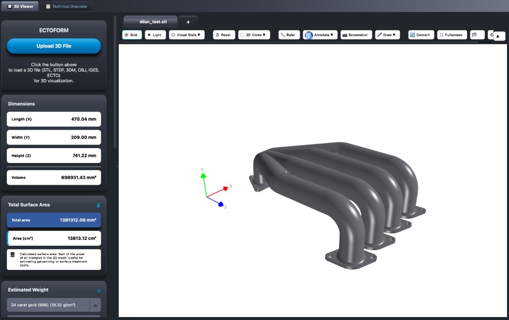
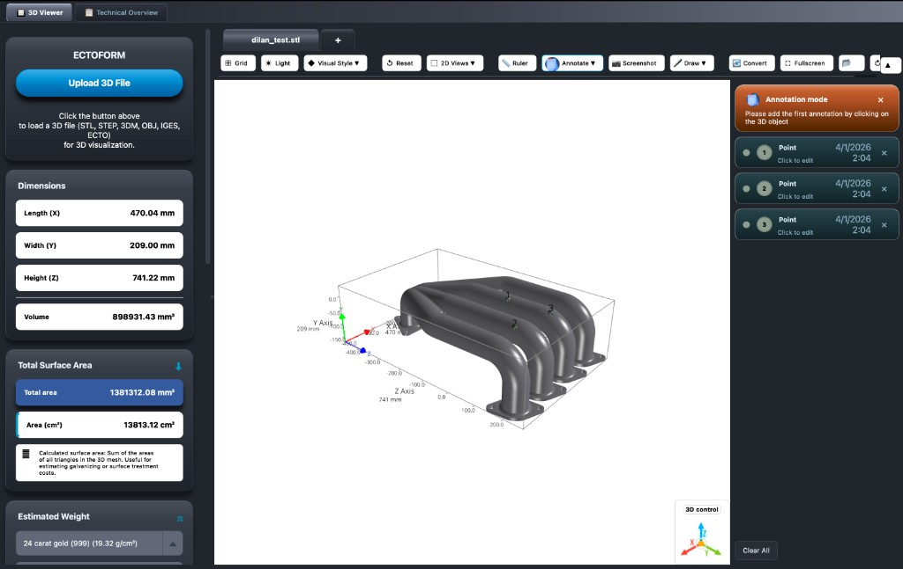
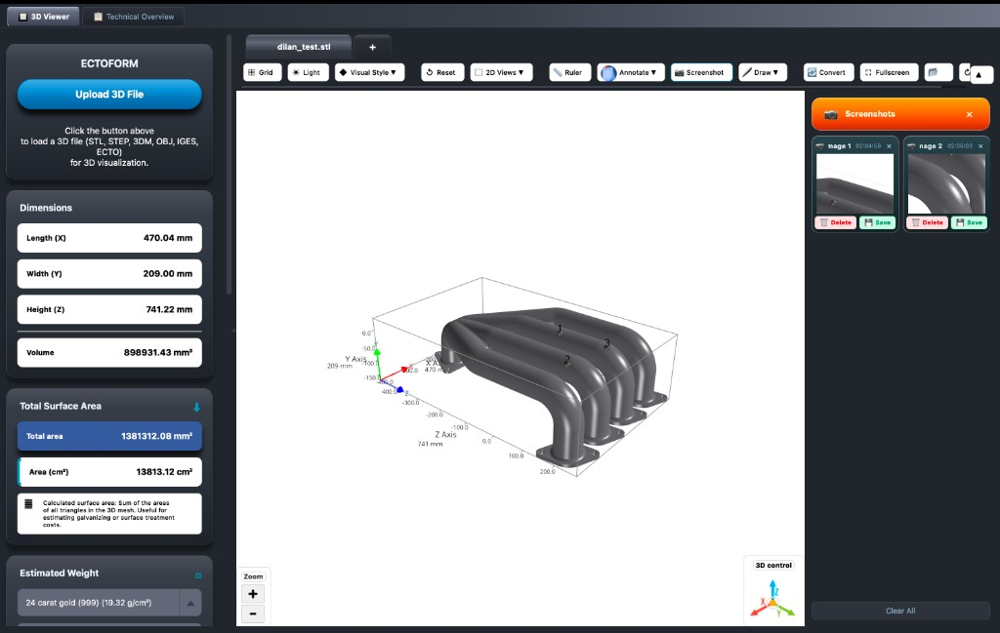
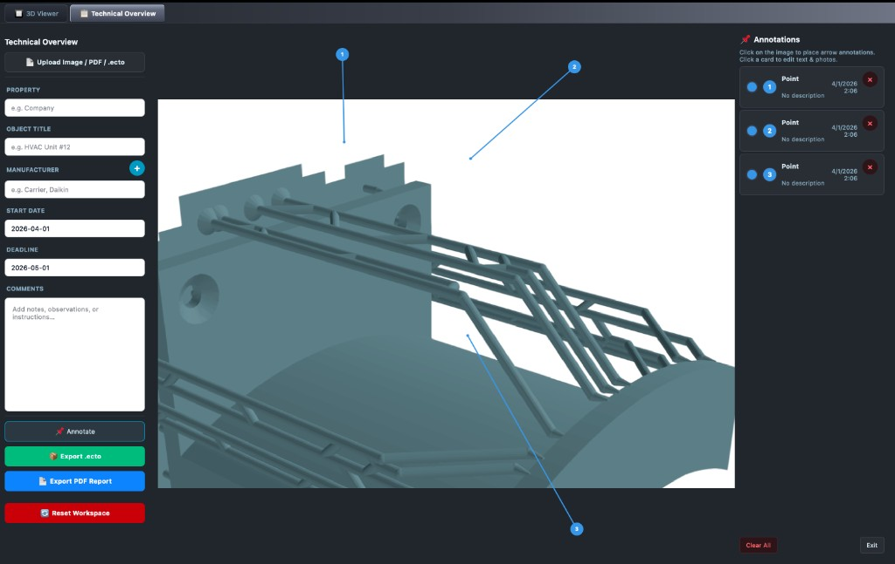

# ECTOFORM

Desktop application for **3D CAD visualization**, **measurement**, **annotations**, and **technical documentation**. Upload industry formats, inspect geometry (dimensions, surface area, estimated weight), work in **3D** or **Technical Overview** modes, and export packaged **`.ecto`** projects or PDF reports.

---

## Screenshots

### 3D Viewer — analysis & viewport

Upload models, review **dimensions**, **volume**, **total surface area**, and **estimated weight** (material library). The toolbar provides grid/lighting, **visual styles** (shaded by default), orthographic **2D views**, **ruler**, **annotate**, **screenshot**, **draw**, conversion, and fullscreen.



### 3D Viewer — annotation mode

Place numbered points on the mesh; edit labels, notes, and photos in the annotation panel. The **Annotation mode** banner uses a warm gradient; annotation cards use a glassy dark theme.



### 3D Viewer — screenshot capture

Capture regions of the 3D view; manage thumbnails, rename images, save or delete. The **Screenshots** header uses an orange gradient card; screenshot tiles match the annotation card styling.



### Technical Overview

Switch mode with **3D Viewer** / **Technical Overview** in the toolbar. Upload **images**, **PDF** pages, or **`.ecto`** bundles, fill technical metadata (property, title, manufacturers, dates, comments), place **arrow callouts** on the canvas, and export **`.ecto`** or **PDF** reports.



---

## Application modes

| Mode | Purpose |
|------|--------|
| **3D Viewer** | Load **STL**, **STEP/STP**, **3DM**, **OBJ**, **IGES/IGS**, or **ECTO** bundles. Inspect the model with orbit/zoom/pan, optional grid and lighting, and **shaded / solid / wireframe** styles. |
| **Technical Overview** | Work with **2D assets** (image, PDF page) or technical **ECTO** content: metadata form, numbered **arrow annotations** from the margin to the image, export and sharing workflows. |

Use the mode control in the main toolbar to switch; each mode keeps its own layout (3D canvas vs technical canvas + side panels).

---

## Key features (3D Viewer)

- **Multi-format upload** — STL, STEP, 3DM, OBJ, IGES, and ECTO packages.
- **Mesh analytics** — Bounding box lengths, volume, triangle-summed **surface area** (mm² and cm²), and **estimated weight** from a built-in material/density list.
- **Visual style** — **Shaded** (default on load), **solid**, or **wireframe**.
- **Views** — Preset orthographic views (front, top, left, etc.) and reset camera.
- **Ruler** — Point-to-point measurements on the model (orthographic ruler workflow).
- **Annotations** — 3D points with labels, text, photos; validation and **ECTO** export of annotations.
- **Draw** — Freehand strokes on the model surface (with color and eraser tools where enabled).
- **Screenshots** — Drag a rectangle on the view to capture; name, save, or remove images.
- **Parts** — Explore connected mesh components when applicable.
- **File converter** — Convert supported CAD inputs where the pipeline is available.
- **Tabs** — Multiple files open as tabs; **ECTO** open/save integrates with the workflow.

---

## Key features (Technical Overview)

- **Upload** — Image, PDF, or `.ecto` technical package.
- **Metadata** — Property, object title, one or more manufacturers, start/deadline dates, comments.
- **Arrow callouts** — Click to place numbered arrows from the margin to features on the image/model view.
- **Export** — **Export .ecto** (bundled project) and **Export PDF report** for documentation.

---

## Requirements

- **Python 3.8+** (3.11–3.12 recommended; PyQt5 is used for broad desktop compatibility)
- Dependencies are listed in `requirements.txt` (PyQt5, mesh tooling, optional PyVista/VTK path, **pygfx** / **WebGPU** stack for the primary 3D viewer on current builds).

## Installation

```bash
python3 -m venv venv
source venv/bin/activate   # Windows: venv\Scripts\activate
pip install -r requirements.txt
```

## Usage

```bash
source venv/bin/activate
python main.py
```

Or on macOS/Linux: `./run.sh`

**3D interaction (typical):** drag to rotate, scroll to zoom, shift-drag or middle-button to pan (exact bindings match your build’s viewer).

---

## Building

- **macOS DMG:** `./build_mac.sh` (see script for outputs).
- **Windows:** CI can produce installers via the repository workflow (see existing `*.spec` and GitHub Actions configuration if present).

---

## Technology overview

ECTOFORM is a **Python** desktop app:

- **PyQt5** — Windows, layouts, dialogs, stylesheets, and desktop integration.
- **3D rendering** — Primary path uses **pygfx** with **wgpu** (WebGPU) and **trimesh** for geometry; a **PyVista/VTK** path may be used where the pygfx stack is unavailable.
- **Mesh I/O & conversion** — **meshio**, **trimesh**, **cadquery** / **rhino3dm** / **ezdxf** etc., depending on format (see `requirements.txt`).
- **Packaging** — **PyInstaller** for standalone executables; assets bundled via spec files.

Reporting and export use libraries such as **ReportLab** where PDF generation is enabled.

---

## Troubleshooting

- Activate the **venv** before `pip install` or `python main.py`.
- If the 3D view is blank, update GPU drivers and ensure WebGPU/WGPU requirements for **pygfx** are satisfied on your OS.
- Logs are written to **`app_debug.log`** in the project directory when using the default `main.py` logging setup.

## License

This project is provided as-is for personal or commercial use.
